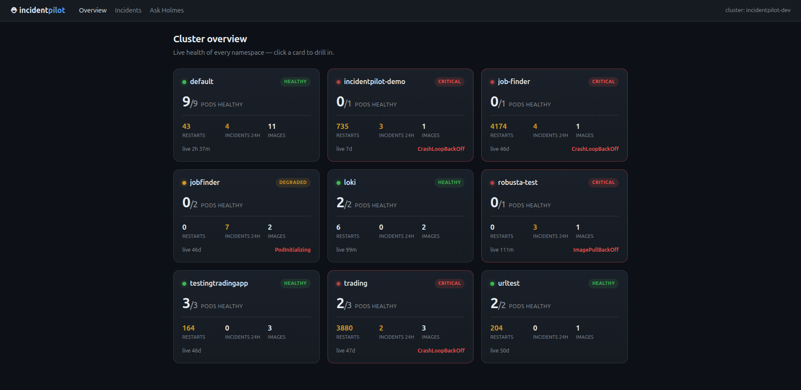
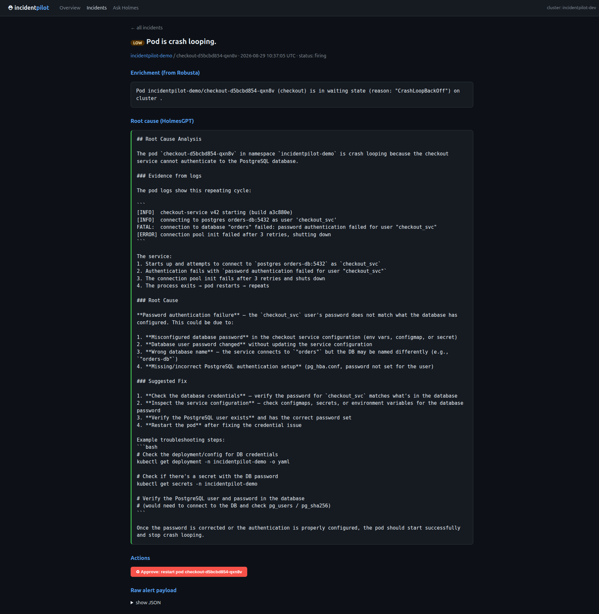
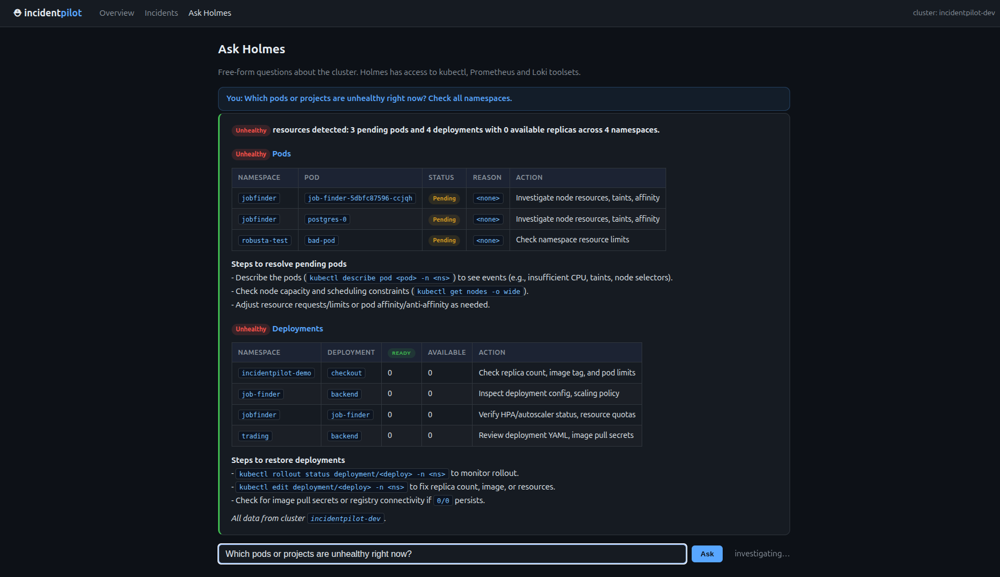

# ⛑ IncidentPilot

**AI-powered incident response platform for Kubernetes.** Failures are
detected in seconds, explained by an AI investigator with live cluster
access, and fixed with one approved click — or automatically, where you
allow it.



## Why

When production breaks, engineers burn the first 20–40 minutes on
archaeology: which pod, since when, what do the logs say. IncidentPilot
collapses that to: open the dashboard → the worst problem is the first
card → click *Run AI investigation* → read the root cause with quoted
log evidence → click *Approve* to fix.

## Features

| | |
|---|---|
| 🗂 **Cluster overview** | A card per namespace: health pill, pods healthy, restarts, incidents, uptime, dominant error. Critical sorts first. Live refresh. |
| 🚨 **Incident feed** | Every failure auto-captured and enriched with logs + events, pushed to Slack and the dashboard within seconds. |
| 💬 **IncidentChat** | Conversational AI with real tools (kubectl, Prometheus, Loki). Ask anything; follow-ups remember context; ChatGPT-style history sidebar. |
| 🔎 **AI root cause** | One click per incident. The AI investigates the live cluster and cites actual log lines — not generic advice. |
| 📜 **Log viewer** | Terminal-style raw logs (level colors, filter, live refresh, crashed-container history) + a plain-English AI summary tab. |
| ⚡ **Operational commands** | Type `restart pod NAME in NS`, `scale DEPLOY in NS to 3`, `rollback DEPLOY in NS` in chat — every mutation shows an approval button first, every execution is audited. |
| 🩺 **Auto-Heal** | Opt-in per namespace: crash-looping pods restarted automatically — max 3/hour per workload, databases excluded, escalates to a human when restarts don't help. Every decision visible in the UI. |
| ⚙️ **Zero-code setup** | Slack, AI providers/keys/models, webhook, cluster name — all configured from the Settings page. No YAML editing to hand the project to someone new. |




## Architecture (short version)

```
your apps ──fail──► alert pipeline (watches API + Prometheus alerts)
                        │ enrich: logs, events, restart counts
                        ├──► Slack
                        └──► console /api/ingest ──► dashboard & incident feed
you ──ask/click──► console ──► IncidentChat AI engine
                                 │ agentic loop: kubectl · logs · PromQL · Loki
                                 └► root cause with evidence
you ──approve──► console ──► one validated kubectl action   (audited)
Auto-Heal ─────► same action, policy-gated, per-namespace opt-in
```

Full detail: [docs/architecture.html](docs/architecture.html) (also served
at `/project-docs/architecture.html` when the console runs).

## Installation

### Prerequisites

- A Kubernetes cluster (tested on kind; any conformant cluster works)
- `kubectl` with admin access, `helm` 3, Python 3.11+
- A Slack workspace (optional but recommended)
- An API key for at least one AI provider (NVIDIA NIM has a free tier;
  OpenRouter/Anthropic/OpenAI/Gemini also supported)

### 1. Install the backend services (once per cluster)

```bash
helm repo add robusta https://robusta-charts.storage.googleapis.com && helm repo update
# generate a starter config (cluster name, optional Slack wizard):
pip install -U robusta-cli && robusta gen-config
# merge deploy/robusta-values.example.yaml into the generated file, then:
helm install robusta robusta/robusta -f generated_values.yaml \
  --set clusterName=<your-cluster-name>
```

Optional log search backend:

```bash
helm repo add grafana https://grafana.github.io/helm-charts
helm install loki grafana/loki-stack -n loki --create-namespace
```

### 2. Run the console

```bash
git clone <this-repo> && cd incidentpilot
./run.sh
# open http://localhost:8010
```

`run.sh` handles everything: virtualenv, dependencies, the AI-engine
port-forward, and the server (auto-reload included).

### 3. Configure from the UI — no files

Open **Settings**:

1. **AI providers** → paste your key → *Test connection* → pick a model → *Activate*
2. **Slack** → bot token + channel → *Test connection* → *Save*
3. **Application** → cluster display name

Done. Break something on purpose to see the whole loop run:

```bash
./scripts/demo.sh crashloop --auto 120
```

## Demo lab

Safe, repeatable failure simulation for live demos — everything confined
to throwaway namespaces, one command to recover:

```bash
./scripts/demo.sh up          # healthy sample app
./scripts/demo.sh crashloop   # CrashLoopBackOff with realistic logs
./scripts/demo.sh oom         # OOMKilled
./scripts/demo.sh chaos       # several failures at once
./scripts/demo.sh recover     # everything back to green
./scripts/demo.sh down        # remove all trace
```

Scenario-by-scenario playbook: [docs/demo-scenarios.md](docs/demo-scenarios.md).

## Repo layout

```
console/     the IncidentPilot application (FastAPI + htmx + SQLite, ~1k lines)
vendor/      third-party components
deploy/      Helm values examples
scripts/     demo lab
docs/        architecture overview, demo playbook, screenshots
run.sh       one-command local launcher
```

## Security notes (read before shared deployments)

v1 is designed for single-user/local use: no login, API keys stored in
the local database and cluster config (same trust level as the cluster
itself). Before exposing the console beyond localhost, put it behind an
authenticating proxy and move keys to Kubernetes Secrets.

## License

MIT — see [LICENSE](LICENSE). Third-party components under `vendor/`
keep their own MIT licenses.
